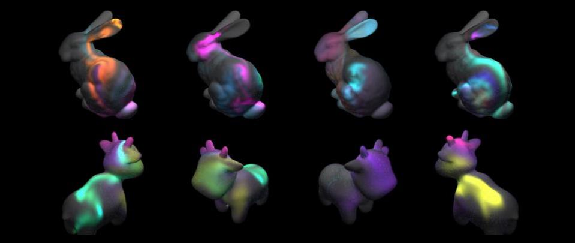

<p align="center">
 
</p>
<h2 align="center">Interactive Surface Flow in Taichi</h2>

 Welcome to my interactive toy of surface flow implemented in [Taichi Lang](https://github.com/taichi-dev/taichi). It creates a real-time fluid simulation on the surface of a triangle mesh manifold with genus 0 based on a slightly modified version of Elcott's [Simplicial Fluids](http://www.geometry.caltech.edu/pubs/ETKSD07.pdf). 

Here are some examples of what it does. It solves the Euler equations in real-time on the mesh surface, and use both colorful dyes and particles to visualize the fluid. I also wrote something over [here]() that briefly explained how my implementation differ from Elcott's algorithm. [insert what machine does it run on] See below for [user guide](#user-guide). 

https://user-images.githubusercontent.com/35747011/177750221-81994db9-5a9b-446f-b6a2-17f2c285764a.mov


https://user-images.githubusercontent.com/35747011/177750239-02a42212-1093-40ed-9765-8b1e502b78da.mov

---

### User Guide

#### How to Obtain and Build

Clone with:

```git clone --recursive https://github.com/yhesper/TaichiSimplicialFluid```

You would also need to install Taichi:

```python3 -m pip install taichi```

```cd meshtaichi_patcher
to do
```

```git submodule update --init --recursive```


#### How to Play

Run with ```python3 fluid.py meshes/bunny.obj``` (or other obj files in ```meshes``` folder.

* Hold your left mouse button to splat dye and splat force on to the system. 
* Press ```r``` to reset the simulation.
* Press ```p``` to pause.
* Press ```esc``` to exit.
* Press ```x``` to take a snap shot.
* Toggle ```c``` to disable or enable changing dye's color.
* Toggle ```v``` to disable or enable advecting particles to visualize the flow.
* Use ```w,a,s,d``` to move camera, and use your right mouse button to rotate camera.


#### Note on stableness

The fluid is advected using an implicit scheme, which is stable. However, excessively adding forces to the system still could result in a very unstable system. If you see ```"Warining: Does not meet Courant–Friedrichs–Lewy condition!"``` being printed out, it means that you have added too much energy to the system  in too short of a period time, and the program will start to decay its energy for a bit until CFL condition is being met again.

